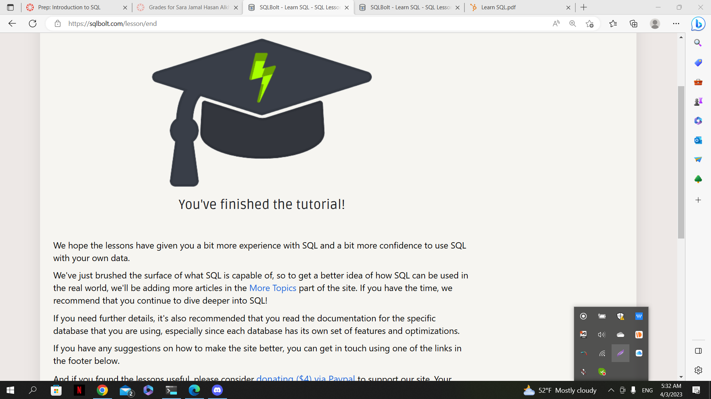

# Summary of Relational Databases and SQL

Relational databases are a type of database management system that store data in tables consisting of rows and columns. SQL (Structured Query Language) is a programming language used to communicate with relational databases and perform operations on them.

## ASC/DESC

ASC and DESC are SQL keywords used in the ORDER BY clause to specify the sort order of the result set. ASC stands for ascending (i.e., from smallest to largest) and DESC stands for descending (i.e., from largest to smallest).

## DISTINCT

DISTINCT is a SQL keyword used in the SELECT statement to return only unique values in a result set. It eliminates duplicate values from the result set and returns only distinct values. The DISTINCT keyword is often used in combination with aggregate functions such as COUNT, SUM, and AVG to perform calculations on unique values in a table. For example, the following SQL query returns the unique values in the "name" column of a "customers" table:

## LIMIT/OFFSET

LIMIT and OFFSET are SQL keywords used in the SELECT statement to limit the number of rows returned by a query. LIMIT specifies the maximum number of rows to return, while OFFSET specifies the number of rows to skip before starting to return the result set.

## ORDER BY

ORDER BY is a SQL keyword used in the SELECT statement to sort the result set by one or more columns in ascending or descending order.

## UPDATE/INSERT/DELETE/CREATE

UPDATE, INSERT, DELETE, and CREATE are SQL keywords used to modify data in a relational database. UPDATE is used to modify existing rows, INSERT is used to add new rows, DELETE is used to remove rows, and CREATE is used to create new tables, indexes, and other database objects.

## ADD ROW/COLUMN

ADD ROW and ADD COLUMN are SQL keywords used in the ALTER TABLE statement to add new rows or columns to an existing table.

## DROP TABLE

DROP TABLE is a SQL statement used to remove an entire table from a relational database. This operation permanently deletes all data and metadata associated with the table.
## Finished my tutorial
